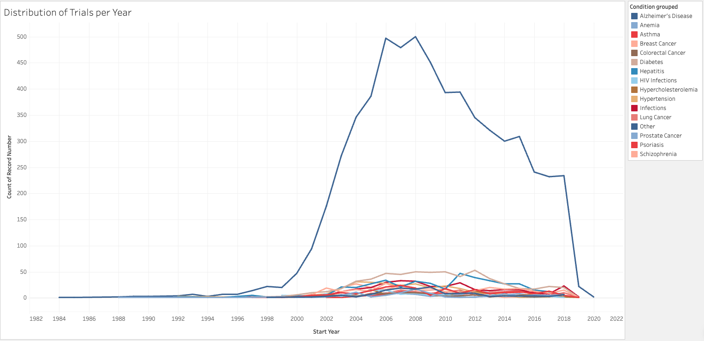
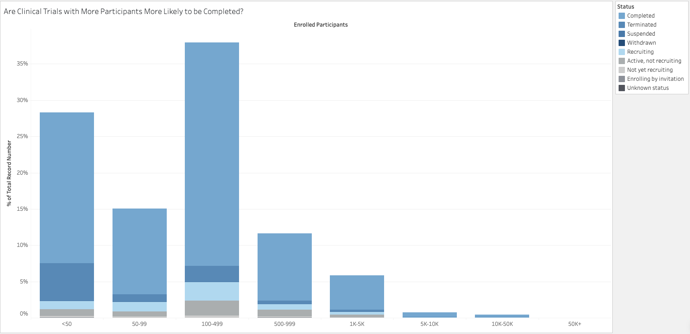
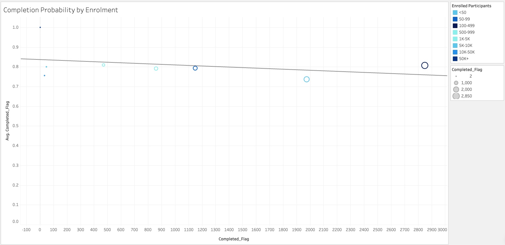
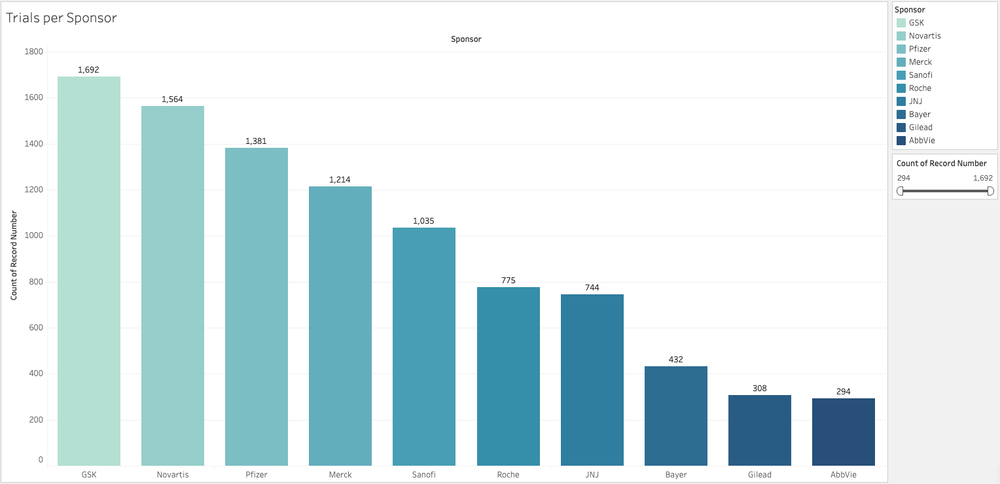

# INSERT LOGO

# Project Clinical Trial Trends

**Project Clinical Trial Trends** is a comprehensive data analysis tool to explore historical clinical trial trends over the years. The tool supports multiple data formats and provides an intuitive interface for both novice and expert data scientists.

## Dataset Content
This dataset holds anonymised information about clinical trials conducted from 1984-2020 by a range of sponsors.

**Source:** [Kaggle Dataset](https://www.kaggle.com/datasets/thedevastator/a-quick-overview-of-clinical-trials)

**Total Columns:** 10 (raw dataset, excluding index)

### Column Descriptions:

| Column Name                      | Description                                                  |
| -------------------------------- | ------------------------------------------------------------ |
| **NCT**                          | National Clinical Trial number                               |
| **Sponsor**                      | Name of the sponsor conducting the clinical trial            |
| **Title**                        | Title of the clinical trail                                  |
| **Summary**                      | Brief summary of the clinical trial                          |
| **Start_Year**                   | Year the clinical trial started                              |
| **Start_Month**                  | Month the clinical trial started                             |
| **Phase**                        | Phase of the clinical trial                                  |
| **Enrollment**                   | Number of participants enrolled in the clinical trial        |
| **Status**                       | Status of the clinical trial                                 |
| **Condition**                    | Condition being tested in the clinical trial                 |

## Business Requirements
The goal of this data analysis project is to explore trends and patterns within Clinical Trials conducted over the years. The primary objectives are:

- To identify which sponsors are most active in conducting Clinical Trials.

- To uncover key factors that influence the successful completion of Clinical Trials, with a focus on enrolment numbers.

- To highlight medical conditions that have a high volume of associated trials.

By gaining deeper insights into these areas, this analysis aims to inform strategic decision-making, uncover potential gaps in research, and support efforts to allocate resources more effectively in under-researched conditions.

## Hypothesis and Validation
The Clinical Trials dataset was loaded in VS code, cleaned, and preprocessed to handle all outliers, missing and duplicate values, along with converting data types ready for hypothesis testing.

### **Hypothesis 1 (Chi-Squared Test):**

Testing to see if the number of clinical trials for a specific condition has increased over the years.

- **Null Hypothesis (H₀):** The number of clinical trials for a specific condition has not increased over the years (no association between Condition and Year).

- **Alternative Hypothesis (H₁):** The number of clinical trials for a specific condition has increased over the years (there is an association between Condition and Year).

p-value: 0.000000000000000535
- Reject the null hypothesis: There is an association between Condition and Year.

### **Hypothesis 2 (Mann-Whitney U Test):**

Testing to see if trials with higher enrolled participants are more likely to reach 'Completed' status.

- **Null Hypothesis (H₀):** There is no difference in the number of enrolled participants between trials with 'Completed' status over other statuses.

- **Alternative Hypothesis (H₁):** Trials with "Completed" status have a higher number of enrolled participants compared to other statuses.

p-value: 0.000000000000018562410266235526
- Reject the null hypothesis: Thrials with 'Completed' status have higher enrollment.

### **Hypothesis 3 (Chi-Squared Test):**

Testing to see if the number of clinical trials is independent of the sponsor

- **Null Hypothesis (H₀):** The number of clinical trials is independent of the sponsor (no association between Sponsor and Condition_grouped).

- **Alternative Hypothesis (H₁):** The number of clinical trials is not independent of the sponsor (there is an association between Sponsor and Condition_grouped).

p-value: 0.0
- Reject the null hypothesis: The number of clinical trials is not independent of the sponsor. 
- Hypothesis 3 visualised with a bar plot to display to distribution across sponsors.

## Project Plan
- Source the dataset from a public domain (Kaggle) & select a random sample of 10,000 clinical trial entries. Given that the full dataset contains unique entries for individual trials, this sample size ensures computational efficiency without compromising analytical integrity, and aligns with project scope guidelines.
- Create a Kanban project board to detail and track all tasks and milestones for the project.
- Ideate hypotheses to be tested and validated.
- Carry out ETL and EDA on the dataset using Python in Jupyter Notebooks. To prepare the dataset for analysis and visualisation (including feature engineering, thematic analysis and clustering(use of Gen AI to assist)).
- Create visualisations in Jupyter Notebook using Seaborn, Matplotlib and Plotly.
- Perform statistical testing in Jupyter Notebook.
- Draw insights and conclusions from analysis.
- Build dashboard in Tableau for data storytelling.
- Evaluate project from ideation phase to dashboard creation.

A mixed-methods approach was used to explore clinical trial trends. A random sample of 10,000 records was analysed to balance performance with data integrity.

Python was used for data cleaning, exploratory analysis, and statistical testing. Thematic analysis was applied to trial summaries using TF-IDF and word clouds to uncover common research focuses by condition groups. Hypotheses were tested using appropriate statistical methods, and clustering was performed to group same/similar conditions as 800+ unique entires of same/similar conditions were identified within the dataset.

Insights were visualised using Python and Tableau to support clear, accessible storytelling.

## The rationale to map the business requirements to the Data Visualisations
| Business Requirement             | Visualisation & Rationale                                    |
| -------------------------------- | ------------------------------------------------------------ |
| Identify the most active sponsors in Clinical Trials                        | **Bar Chart:** 	A ranked bar chart clearly highlights which sponsors conduct the most trials, allowing for easy comparison and identification of key players in the industry.                          |
| Uncover key factors influencing trial completion (e.g. enrolment)                     | **Stacked Bar Chart:** A stacked bar chart displays the distribution of trial completion status within each enrolment bin. This visualisation makes it easy to compare the proportion of completed and non-completed trials across different enrolment groups, helping uncover patterns and key factors affecting outcomes.         | 
| Spot trends in trial activity over time                        | **Line Chart:** This shows how research activity has evolved, helping identify periods of growth or stagnation in clinical research.                                 | 
| Uncover common research themes within conditions                     | **Word Clouds:** Word clouds provide a thematic overview of trial summaries, revealing repeated focus areas or under-explored aspects in relation to specific conditions.                         | 

## Analysis techniques used
### **Data Analysis Methods Used:**
- **Exploratory Data Analysis (EDA):** Identified trends in enrolment, completion status, and most common conditions.

- **TF-IDF Vectorisation + DBSCAN Clustering:** Grouped semantically similar medical conditions based on their text descriptions.

- **Text Cleaning and Keyword Mapping:** Created custom mappings to categorise trials into broader condition groups.

- **Cosine Similarity Analysis:** Measured closeness between condition terms.

- **Statistical Testing (e.g. Chi-Squared, Mann-Whitney U):** To validate hypotheses (e.g. enrolment vs completion).

- **Data Visualisation (Tableau, Plotly, Matplotlib, Seaborn):** Translated trends into clear visuals aligned with business goals.

**Limitations:**
- **DBSCAN Sensitivity:** DBSCAN clustering depends heavily on eps and min_samples, which can lead to noise or fragmented clusters.
**Alternative:** Hierarchical clustering or HDBSCAN could adapt better to varying densities.

- **TF-IDF Simplicity:** Doesn’t capture deeper semantic meaning of conditions.
**Alternative:** Use embeddings (e.g. ClinicalBERT or Sentence Transformers) for richer text representation.

- **Manual Mapping:** While keyword-based condition grouping is practical, it's not scalable.
**Alternative:** Use unsupervised topic modeling (LDA) or zero-shot classification to automate grouping.

### **Structure of Data Analysis Techniques:**
- **Data Cleaning & Preprocessing:** Removed inconsistencies and standardised condition names.

- **TF-IDF + Cosine Similarity:** Captured textual patterns across condition labels.

- **Clustering (DBSCAN):** Uncovered underlying groupings of related conditions without predefining the number of clusters.

- **Manual Grouping:** Mapped top conditions to simplified categories to support visualisation and interpretation.

- **EDA & Visualisation:** Used condition clusters and categories to uncover trends in enrolment and trial activity.

This structure ensured both exploratory depth and visual clarity, with clustering helping reveal hidden structure in messy textual data.

### **Data Limitations:**
- The 'Condition' field was highly inconsistent and noisy, with overlaps and synonyms. So text cleaning, TF-IDF vectorisation, and cosine similarity were used to better align similar terms.

- No labels existed to validate cluster quality. Conditions were manually validated and grouped, post-clustering to align with known medical categories.

- DBSCAN requires tuning and doesn't always form intuitive groups. Combined clustering results with a domain-informed keyword mapping for better interpretability.

### **Generative AI uses (CoPilot & ChatGPT):**
**Ideation & Design**
- Used GenAI to brainstorm visualisation ideas in line with the hypotheses. 
- Assisted in finding an appropriate clustering technique for short, sparse text fields like condition names.

**Code Optimisation**
- Used AI to debug issues in code, distance matrices and clipping strategies.
- Refactored preprocessing and clustering code.
- Code generation for some of the plots in Jupyter Notebook.

## Ethical Considerations
**Data Privacy, Bias & Fairness**
- The dataset did not contain any personally identifiable information, so no anonymisation was required.
- Clustering the data could potentially under-represent certain conditions in the visualisations. To minimise bias, the top 20 most frequently occurring conditions in the dataset were identified and used for condition mapping.

**Legal Issues**
- The dataset used in this project is publicly available and licensed to permit sharing, adaptation, and commercial use, provided that appropriate credit is given. Full attribution has been maintained throughout, ensuring compliance with the dataset’s licensing terms and ethical standards.

## Conclusion
*Summary of analysis created with CoPilot assistance*

Our analysis looked at three main questions about clinical trials:

- Are more clinical trials being done for certain conditions over time?
Yes—there has been a clear and significant increase, especially for conditions like breast cancer and Alzheimer’s disease. This likely reflects growing research interest and advances in these areas.

- Do trials with more participants finish more often?
Yes—trials with higher enrollment are much more likely to be completed. Larger studies may get more support and have a better chance of reaching their goals.

- Does the number of trials depend on who is funding them?
Yes—some large companies, like GSK, Novartis, and Pfizer, sponsor many more trials than others. This means clinical research is often led by a small number of major sponsors.

In summary:
Clinical trials are increasing, especially in certain health areas and among larger sponsors. Trials with more participants are more likely to finish. To improve research, it would help to support a wider range of sponsors and conditions.

## Dashboard Design
A dashboard was created on Tableau to provide a comprehensive visualisation of Clinical Trial trends over the years. With a focus on enrollment numbers, sponsors, completion status and the overall distribution of Clinical Trials from 1984-2020.

During development a BoxPlot was initially used to explore whether higher enrolment correlates with succesful completion of Clinical Trials. However, a BoxPlot wasn't suitable to convey the relationship to a non-technical audience, so a Stacked Bar Chart was used instead.

This dashboard was dsigned with non-technical users in mind, to clearly convey the patterns within this Clinical Trials dataset. The dashboard includes a range of features such as filters to allow for user customisation and clearly labelled visualisations, to ensure inclusivity and ease of use for both technical and non-technical audiences.

[Tableau Dashboard Link](https://public.tableau.com/views/ClinicalTrialTrends/Dashboard1?:language=en-GB&:sid=&:redirect=auth&:display_count=n&:origin=viz_share_link)

### Tableau Dashboard Pages
**Distribution of trials per year**

**Enrolment by Completion Status**

**Completion Probability by Enrolment**

**Trials per Sponsor**

## Unfixed Bugs
There are no unfixed bugs present in this project. All bugs, errors and issues encountered in vs code were identified and addressed during the development process. CoPilot was leveraged to provide debugging assistance. 

During EDA gaps in my knowledge relating to thematic text analysis and clustering were identified. These were addressed by revisiting the learning materials in the LMS. Additionally, consulting ChatGPT to clarify terminology and methodology. 

## Development Roadmap
- I faced issues with vs code in both the Jupyter Notebook and Terminal when installing packages, importing some libraries etc. These challenges were overcome with CoPilot assistance and manually troubleshooting commands and lines of code.

- I'd like to expand on my deployment skills such as, deploying my next dashboard in a Streamlit app. 

## Main Data Analysis Libraries
* Here are the main data analysis libraries used in the project and how they were used:

| Library             | Analysis Category                   | How It Was Used                                              |
|-----------------------------|------------------------------------|---------------------------------------------------------------|
| **pandas**                  | ETL, EDA, Main Data Analysis       | Data loading, cleaning, manipulation, summarisation           |
| **numpy**                   | ETL, EDA, Main Data Analysis       | Numerical computing, array operations, mathematical functions |
| **matplotlib.pyplot**       | Visualisation, EDA                 | Basic plotting and visualisation                              |
| **seaborn**                 | Visualisation, EDA                 | Statistical and advanced data visualisation                   |
| **plotly**  | Visualisation, EDA       | Interactive, web-based visualisations                         |
| **scipy.stats**             | Statistical Analysis, EDA          | Statistical tests and hypothesis testing                      |
| **scikit-learn** | Machine Learning, Feature Engineering, EDA | Preprocessing, clustering, modeling, text analysis |
| **Tableau**                 | Visualisation, Reporting           | Interactive dashboards and advanced data visualisation (external tool, not a Python library) |

## Credits 

- ChatGPT for clarification of terminology and methodology. 
- Microsoft CoPilot for debugging assistance, code creation, code assistance, summary of findings and clarity in project ideation.
- Code Institute's LMS for clarification on thematic analysis and how it should be approached.
- [Tableau Forum](https://community.tableau.com/s/question/0D54T00000C69PXSAZ/calculating-skewness-and-kurtosis-for-a-distribution-in-tableau-as-formula) to improve my understanding in calculating Skewness in Tableau for visualisations.
- [Markdown Cheat Sheet](https://www.markdownguide.org/cheat-sheet/) to help me format my README.md file.

### Content 

- Dataset is from [Kaggle](https://www.kaggle.com/datasets/thedevastator/a-quick-overview-of-clinical-trials), Kaggle author sourced it from [Aero Data Lab](https://www.aerodatalab.org/lander)
- GitHub repository template is from [Code Institute](https://github.com/Code-Institute-Org/data-analytics-template/tree/main)
- README.md template is from [Code Institute](https://github.com/Code-Institute-Solutions/da-README-template)

### Media

- The photos used on the home and sign-up page are from This Open-Source site
- The images used for the gallery page were taken from this other open-source site

## Acknowledgements (optional)
* Thank the people who provided support through this project.

